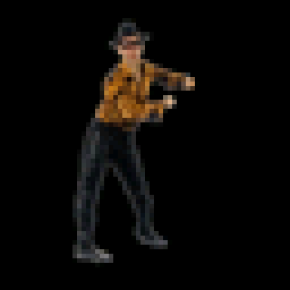
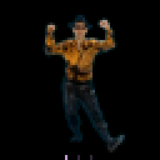
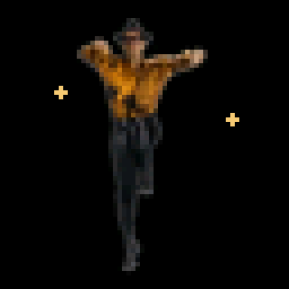
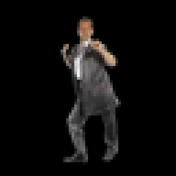
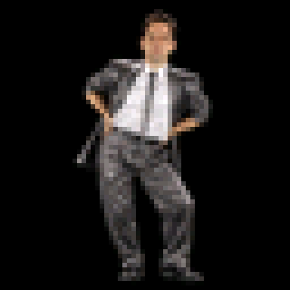
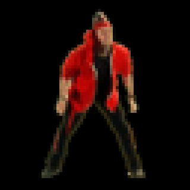

# Celery Man for Muse

Your desk requires a little more Tayne.

Tayne, Celery Man, and Oyster as animated companions for [Muse](https://github.com/facebookincubator/muse-gadget-sdk). They dance while idle and react while Muse listens and speaks.

Tayne's dances use frames from the sketch, including the low bounce and Flarhgunnstow sequence.
He swings his arms while listening, kicks with his arms raised while thinking, and switches to the sketch's close-up while speaking.

Celery Man uses three dances from the sketch: hip sway while idle, raised-fist shuffle while listening and speaking, and 4d3d3 when happy. Thinking adds dots below his feet.

Oyster also comes straight from the footage. He headbangs while idle, swings his arms back while listening, waves while speaking and when happy, and prints out his own smiling portrait while thinking.

| Tayne | Celery Man | Oyster |
| :---: | :---: | :---: |
|  |  |  |

## Tayne’s moves

| Low bounce | Arm swing | Raised-arm kicks | Close-up | Flarhgunnstow |
| :---: | :---: | :---: | :---: | :---: |
|  |  |  |  |  |
| Idle | Listening | Thinking | Speaking | Happy |

## Celery Man’s moves

| Hip sway | Raised-fist shuffle | 4d3d3 |
| :---: | :---: | :---: |
|  |  |  |
| Idle; thinking adds dots | Listening and speaking | Happy |

## Oyster’s moves

| Headbang | Arms back | Greeting | Printout |
| :---: | :---: | :---: | :---: |
|  |  |  |  |
| Idle | Listening | Speaking and happy | Thinking |

## Get started

You'll need a compatible device, a USB data cable, and a Muse account. Start with the [installation guide](INSTALL.md) to build and flash the firmware.

The StickS3 has been tested on hardware. Build profiles and controls are also included for StickC Plus2, AIPI Lite, SenseCAP Watcher, and two Waveshare touchscreen boards. See [devices and screen sizes](DEVICES.md) for testing status.

## Choose a character

**Buttons:** open the menu with the side/menu button, choose **Character** with the front/select button, then select a character. Your choice is saved.

**Touchscreens:** swipe to Settings, open **Character**, and tap a name.

**Pet** restores Muse's original avatar. It is also available as **Default pet** in the character list.

Muse still handles conversations, voice, and pairing. This pack changes the character on screen.

## A few things to know

This is an early project. We’re still investigating intermittent power-related resets on the StickS3. A physical restart has recovered our test device. Details and test results are in [TESTING.md](TESTING.md).

Want to change the art or add a device? See [DEVELOPMENT.md](DEVELOPMENT.md). [ART.md](ART.md) records where every animation comes from in the sketch.

Inspired by [Tim & Eric's Celery Man sketch](https://www.youtube.com/watch?v=a8K6QUPmv8Q). An unofficial fan project. Code is [Apache-2.0](LICENSE); that license does not grant rights to the original characters, likenesses, or trademarks. See [credits](NOTICE).
